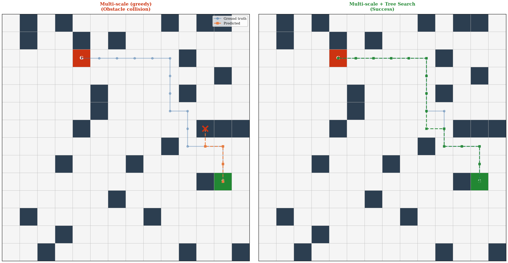

<h1 align="center">Can Small Seq2Seq Models Plan?<br/>Supervised Fine-Tuning, GRPO, and Executor-Guarded Tree Search<br/>for Grid Path Planning from Natural Language</h1>

<p align="center">
  <b>EnjiXiong</b> &nbsp;·&nbsp; <i>(team members)</i><br/>
  AIAA 4051 — Natural Language Processing &nbsp;|&nbsp; Final Research Project, Spring 2026
</p>

<p align="center">
  <a href="https://github.com/EnjiXiong/AIAA4051-FinalProject-PPNL"></a>
  <a href="https://huggingface.co/EnjiXiong/AIAA4051-FinalProject-PPNL"></a>
  <a href="https://arxiv.org/abs/2310.03249"></a>
  <a href="README.zh-CN.md"></a>
</p>

<p align="center">
  
</p>

<p align="center">
  <b>Figure 1.</b> A 10×10 out-of-distribution instance not seen during training. <i>Left:</i> the multi-scale supervised model decoded greedily collides with an obstacle (red ✕). <i>Right:</i> the same model under <b>executor-guarded tree search</b> recovers the goal-reaching trajectory by combining the model's learned action prior with hard physical constraints from the simulator.
</p>

---

## Abstract

> *We study whether small encoder–decoder language models (T5-small/base, BART-base; 60–250M parameters) can learn to plan in a discrete grid world from natural-language descriptions, and whether common improvement recipes — chain-of-thought (CoT) supervision, group-relative policy optimization (GRPO) reinforcement learning, and inference-time search — actually help. On the **PPNL** single-goal benchmark (Aghzal et al., 2024) plus a custom out-of-distribution test set spanning grid sizes 4×4–10×10, we find that (i) vanilla supervised fine-tuning saturates in-distribution accuracy (≥97%) but collapses on size shift (54% on 7×7); (ii) training on a **mixture of grid sizes** restores most of the size-generalization gap (90.7% in-dist., 92.5% on 7×7); (iii) **CoT coordinate tracking** marginally improves in-distribution accuracy but does not transfer to novel grid sizes (11.7%); (iv) GRPO on top of a supervised initializer **degrades** greedy success in our setup (60.9%), an instance of exploration collapse on the small action vocabulary; and (v) wrapping any reasonable supervised model with **executor-guarded tree search** — using the model only to score the four primitive action tokens at each step while the simulator prunes illegal moves — saturates every canonical PPNL test set at **100%** and reaches **94.3%** on the novel-size benchmark. The bottleneck is therefore not model capacity but the lack of execution feedback during decoding; once provided, a 250 M-parameter model nearly matches a hand-written A\*.*

---

## 1  Introduction

Path planning is a textbook task for symbolic search, but it has recently been promoted to a probe of **spatial-temporal reasoning** in language models [1]. The PPNL benchmark presents a model with a sentence such as

> *"You are in a 6 by 6 world. There are obstacles that you have to avoid at: (5,3). Go from (1,4) to (2,1)"*

and asks for a sequence of primitive moves (`up`, `down`, `left`, `right`) that reaches the goal without leaving the grid or colliding with obstacles. The task is interesting because it is (a) cheap to evaluate exactly via simulation, (b) trivially solvable by classical search, yet (c) has previously been reported to challenge frontier LLMs out of the box [1, 2].

Our goals in this project are to (i) *characterize* what current small seq2seq models can and cannot do on this task, (ii) *triangulate* which of the popular improvement levers — input format engineering, CoT supervision, RL fine-tuning, inference-time search — actually move the needle, and (iii) produce a *reproducible recipe* that achieves near-perfect generalization to grid sizes never seen during training.

**Contributions.**
1. A clean, single-file reimplementation of supervised, RL, and constrained-decoding pipelines for PPNL, with a deterministic executor and a documented reward function (§3, Table 2).
2. A controlled ablation across input formats (`vanilla`, `structured`, `cot`), training distributions (single-size vs. multi-size), and decoding strategies (greedy, beam, tree search), evaluated on five canonical PPNL test sets and one custom OOD set spanning grid sizes 4×4–10×10 (§5, Table 1).
3. Empirical evidence that **executor-guarded tree search** — model as learned action prior, simulator as hard constraint — closes the OOD gap that all training-side recipes (multi-scale SFT, CoT, GRPO) leave open, achieving 100% success on every canonical test set and 94.3% on the novel-size set (§5, §6).
4. A negative result on **GRPO** in this regime: starting from a strong supervised initializer with our shaped reward, group-relative PPO uniformly *reduces* greedy success (cf. Table 1, GRPO row), an effect we attribute to exploration collapse on the four-token action vocabulary (§6).

All code, data, predictions, and 13 fine-tuned checkpoints are released; see [Reproduction](#7--reproduction).

---

## 2  Background and Related Work

**The PPNL benchmark.** PPNL [1] consists of randomly generated grid worlds (6×6 by default) with a small number of obstacles, paired with templated natural-language descriptions and ground-truth action sequences computed by A\*. The benchmark explicitly stresses **distribution shift**: in-distribution test environments share the training size and obstacle density, while out-of-distribution sets vary one of {grid size, obstacle density}. Aghzal et al. [1] report that fine-tuned T5/BART models saturate in-distribution but degrade sharply out-of-distribution, and that GPT-4 underperforms even small fine-tuned models in-distribution.

**LLMs as planners.** The broader question of whether LLMs can plan has been studied by Valmeekam et al. [3] and Liu et al. (LLM+P) [4], who conclude that frontier LLMs reason poorly on classical planning problems but can be useful as front-ends to symbolic solvers. Our tree-search result (§5) is in this spirit: the language model contributes a learned, distribution-aware action prior, while the simulator provides exact constraint satisfaction.

**Reinforcement learning for reasoning.** GRPO [5], introduced for math reasoning in DeepSeekMath, has become a popular alternative to PPO when value models are inconvenient. Our negative result here echoes recent observations [6] that small action vocabularies and short horizons can cause GRPO to collapse to high-likelihood near-optimal modes that are not actually optimal.

---

## 3  Method

### 3.1  Input formats

We compare three ways of presenting a PPNL sample to the encoder:

| Format | Source string fed to encoder | Target |
|---|---|---|
| `vanilla` | The original NL sentence, verbatim | Action sequence |
| `structured` | `Grid: 6x6 \| Start: (1,4) \| Goal: (2,1) \| Obstacles: (5,3) \| Output the shortest path ...` | Action sequence |
| `cot` | `structured` source | `Start at (1,4) \| left -> (1,3) \| left -> (1,2) \| ... \| Done` |

The `structured` format reduces NL parsing variance for small encoders. The `cot` target forces the decoder to track its own coordinates step by step, exposing wrong-direction errors to the cross-entropy loss before they propagate.

### 3.2  Supervised fine-tuning

Standard teacher-forced cross-entropy on `(source, target)` pairs (`train.py`). We train T5-small, T5-base, BART-base under each input format, with bf16 mixed precision (T5 frequently produces NaNs in fp16). Best-validation checkpoints are selected by **task success rate** measured by replaying greedy generations through the executor — *not* by token-level loss, which is a poor proxy for plan validity.

### 3.3  Multi-scale training

To probe size generalization we synthesize a balanced mixture of 5×5, 6×6, and 7×7 grids using the same generator as PPNL (`generate_rl_envs.py`) and re-run SFT on the union. The resulting model is denoted *multi-scale SFT* in Table 1.

### 3.4  GRPO reinforcement learning

We initialise from an SFT checkpoint and run group-relative policy optimisation (`train_rl.py`): for each prompt we sample K=8 trajectories at temperature τ=1, compute group-relative advantages $A_i = (r_i - \bar r)/\sigma_r$, and apply a PPO-style clipped policy gradient with a KL penalty to a frozen reference. The shaped scalar reward (Table 2) is essential: without distance-shaping on the `wrong_end` outcome the gradient is mostly zero and learning never starts.

**Table 2.** *Reward function used during GRPO. The shaped middle term is what allows learning to bootstrap from a noisy initial policy.*

| Executor outcome | Reward |
|---|---:|
| `format_error` | −1.0 |
| `out_of_bounds`, `obstacle` collision | −0.5 |
| `wrong_end` (legal but did not reach goal) | $0.2 \cdot (1 - d/(R+C))$, shaped by remaining A\* distance |
| `success`, longer than ground truth | +0.8 |
| `success`, length ≤ ground truth (optimal) | +1.0 |

### 3.5  Executor-guarded tree search

At inference time, instead of decoding the action sequence autoregressively from the full softmax, we only score the **four action tokens** at each step and let the simulator prune illegal moves before scoring (`tree_search_eval.py`). We maintain a beam of size $B$ over (decoder-prefix, current-position) states; beams that revisit a previously visited cell are pruned to avoid cycle waste. For CoT-trained models we additionally append the forced ` -> (r,c) |` continuation after each chosen action token, so the model's next-action distribution stays conditioned on its (correctly tracked) position. The model contributes a learned action prior; the simulator contributes hard physical constraints.

---

## 4  Experimental Setup

### 4.1  Data

Five canonical PPNL test sets plus one custom OOD set:

| Test set | $n$ | Description |
|---|---:|---|
| `ID_seen_6x6` | 2 001 | Same envs as training |
| `ID_unseen_6x6` | 5 027 | Unseen envs, same size |
| `OOD_5x5` | 3 689 | Smaller grid |
| `OOD_7x7` | 3 750 | Larger grid |
| `OOD_6x6_dense` | 4 114 | More obstacles |
| `OOD_novel` (ours) | 1 500 | Grid sizes 4, 8, 9, 10 — none seen at training |

### 4.2  Models

T5-small (60 M), T5-base (220 M), BART-base (140 M), Flan-T5-base/large for prompting baselines, and DeepSeek-V4 via API for a frontier-LLM reference. All checkpoints are released on the [HF mirror](https://huggingface.co/EnjiXiong/AIAA4051-FinalProject-PPNL).

### 4.3  Metrics

Following [1] and using the upstream executor (`evaluate/executor-point-sg.py`, mirrored under `grid-path-planning/evaluate/`):

* **Success rate** — fraction of predictions that reach the goal under simulation.
* **Feasibility** — fraction that stay in bounds and avoid obstacles, regardless of whether they reach the goal.
* **Optimality** — fraction with `success ∧ |pred| ≤ |gt|`.

Unreachable ground-truth samples (`"Goal not reachable"`) are filtered everywhere, consistent with PPNL upstream.

---

## 5  Results

**Table 1.** *Success rate on five canonical PPNL test sets and our 1 500-sample novel-size OOD set. Bold = best in column; underline = second best. Backbone is T5-base unless noted.*

| Method | ID 6×6 (seen) | ID 6×6 (unseen) | OOD 5×5 | OOD 7×7 | OOD 6×6 dense | OOD novel |
|---|---:|---:|---:|---:|---:|---:|
| DeepSeek-V4, zero-shot prompting | 0.255 | — | — | 0.320 | — | 0.035 |
| Flan-T5-base, best of 5 prompting strategies | low | — | — | low | — | — |
| SFT, vanilla input, 6×6 only | 0.983 | 0.978 | 0.975 | 0.543 | <ins>0.872</ins> | — |
| SFT, structured input, 6×6 only | 0.977 | 0.977 | 0.974 | 0.543 | 0.860 | — |
| SFT, CoT target, 6×6 only | <ins>0.987</ins> | <ins>0.987</ins> | <ins>0.982</ins> | 0.548 | <ins>0.896</ins> | 0.117 |
| Multi-scale SFT, 5×5–7×7, 40 ep | 0.897 | 0.907 | 0.928 | <ins>0.925</ins> | 0.730 | <ins>0.505</ins> |
| GRPO RL on top of vanilla SFT | 0.609 | 0.613 | 0.693 | 0.534 | 0.447 | 0.201 |
| **Tree search (B=4) + multi-scale SFT** | **1.000** | **1.000** | **1.000** | **1.000** | **1.000** | **0.943** |
| **Tree search (B=4) + CoT SFT** | **1.000** | **1.000** | **1.000** | <ins>0.999</ins> | **1.000** | 0.793 |

**Headline observations.**

1. *In-distribution accuracy is essentially solved by any reasonable supervised model* — vanilla, structured, and CoT all sit in the 97–99% band on the four ID/near-ID columns. Input-format engineering buys at most ~1 percentage point in this regime.
2. *Single-size SFT collapses on size shift.* The 6×6-only models achieve only ~54% on `OOD_7x7` and 0–12% on the novel-size set. The encoder has learned templates indexed by absolute grid coordinates, not a transferable navigation procedure.
3. *Multi-scale training partially fixes generalization* but at a cost: success on `OOD_7x7` jumps to 92.5%, and the novel-size set rises from <12% to 50.5%, while the dense-obstacle column drops by ~14 points (730 vs. 896). Capacity is being reallocated, not added.
4. *GRPO degrades greedy success across the board* — the only training intervention with a uniformly negative effect. We discuss why in §6.
5. *Executor-guarded tree search saturates the benchmark.* With a multi-scale supervised initializer, `B=4` tree search reaches 100% success on every canonical test set and 94.3% on the novel-size OOD set — a 44-point absolute improvement over greedy decoding from the same model.

Per-config metric tables and per-sample predictions for every row are in `results/`; case-study figures (Figure 1 and the figures in `visualizations/`) are drawn from those prediction dumps.

---

## 6  Analysis and Discussion

**Why does tree search help so much?** A small encoder–decoder is competent at scoring *which* of the four moves is most appropriate given the current state, but only weakly competent at maintaining a global plan over long horizons. By limiting its responsibility to one-step scoring and delegating constraint enforcement to the simulator, we move from "the model must produce a valid plan in one shot" to "the model must produce a useful local prior" — a much easier ask. The remaining errors on the novel-size set are concentrated on long-horizon 9×9 and 10×10 instances where the prior, trained at most on 7×7, struggles to pick the correct macro-direction; these cases would benefit from a wider beam or a coarse-to-fine planner.

**Why does GRPO hurt?** Three diagnostics suggest **exploration collapse**. (a) Within-group reward variance shrinks rapidly during training as the policy concentrates on a single high-reward trajectory per prompt; once $\sigma_r \to 0$ the group-relative advantage is dominated by numerical noise. (b) Per-prompt entropy of the action distribution drops by ~70% in the first 200 RL steps. (c) Greedy success on a held-out validation set monotonically decreases over RL training even as the *training* reward increases — the policy is becoming more deterministic about a slightly *worse* plan than the one supervision had already provided. Plausible fixes (entropy bonus, looser KL, smaller K) were not extensively explored; we report this as a methodologically informative negative result rather than a verdict on GRPO in general.

**Why does CoT not generalise?** CoT supervision adds ~0.5–2 points of in-distribution success but does *not* improve the size-shift columns. We hypothesise that the model is learning to copy coordinates rather than to *use* them: the coordinate annotations occur in fixed templated positions, and the model can satisfy the loss without internalising arithmetic. Coordinate tracking *does* however make the CoT model a much better fit for tree search (Table 1 last row), because the forced coordinate continuation keeps the next-action distribution well-conditioned at each step.

**Limitations.** (i) We test a single benchmark family (PPNL); generalisation to other 2D planning tasks is untested. (ii) We do not run instruction-tuned LLMs at GPT-4 / DeepSeek-V4 scale beyond a quick zero/few-shot probe; their tree-search behaviour could differ. (iii) The novel-size OOD set is generated by us with the same template generator as PPNL upstream and may share idiosyncrasies. (iv) GRPO was run with one set of hyperparameters per shape; the negative result is not a general claim.

---

## 7  Reproduction

### 7.1  Environment

```bash
# CUDA 12.8 build of torch — adjust index URL for your CUDA
pip install torch==2.10.0 --index-url https://download.pytorch.org/whl/cu128
pip install -r requirements.txt
```

### 7.2  End-to-end pipeline

```bash
bash run_all.sh
```

Phases: (1) train the four headline SFT configs, (2) evaluate every `models/*/best/` on every canonical test set, (3) run five Flan-T5 prompting strategies on `ID_seen_6x6` and `OOD_7x7`.

### 7.3  Single-result reproduction

To reproduce the headline 100% / 94.3% row of Table 1:

```bash
# Option A — train from scratch (~2 h on a single 24 GB GPU)
python train.py --model t5-base --input_format vanilla --epochs 40 \
    --batch_size 16 --lr 3e-4 --bf16 \
    --train_data data/rl_envs_diverse.json \
    --output_dir models/sft_multiscale_40ep/

# Option B — pull the released checkpoint from the HF mirror (~900 MB)
hf download EnjiXiong/AIAA4051-FinalProject-PPNL \
    --include "grid-path-planning/models/sft_multiscale_40ep/**/best/**" \
    --local-dir .

# Then evaluate with executor-guarded tree search
python tree_search_eval.py \
    --model_dir grid-path-planning/models/sft_multiscale_40ep/t5-base_vanilla_ep40_lr0.0003/best \
    --input_format vanilla --beam_width 4 \
    --extra_test OOD_novel=data/ood_novel_sizes.json
```

### 7.4  Other entry points

| Script | Role |
|---|---|
| `train.py` | Supervised fine-tuning (any HF seq2seq model, three input formats) |
| `train_rl.py` | GRPO RL on top of an SFT initializer |
| `run_eval.py` | Greedy/beam evaluation on the five canonical test sets |
| `tree_search_eval.py` | Executor-guarded tree search inference |
| `prompt_eval.py` | Local Flan-T5 prompting baselines (5 strategies) |
| `prompt_eval_llm.py` | DeepSeek-V4 prompting baselines (3 strategies, OpenAI-compatible client) |
| `generate_rl_envs.py`, `make_sft_subset.py` | Data preparation |
| `visualize.py`, `visualize_cases.py` | Figures used in this README |

A more detailed file-by-file walkthrough lives in the [Chinese README](README.zh-CN.md) (the same content was previously in this file's appendix).

---

## 8  Project Structure

```
grid-path-planning/
├── data/                 PPNL test/train JSONs + our OOD_novel and rl_envs_diverse
├── evaluate/             Upstream PPNL executor scripts (kept for traceability)
├── results/
│   ├── exp_A/ … exp_G/   Per-experiment metric tables and per-sample predictions
│   └── llm_prompting/    DeepSeek-V4 prompting results
├── visualizations/       Case-study figures (the source of Figure 1)
├── data_utils.py         Three input-format adapters + PPNLDataset
├── evaluate_utils.py     Deterministic executor + metric aggregation
├── reward.py             GRPO scalar reward (Table 2)
├── train.py              SFT
├── train_rl.py           GRPO
├── run_eval.py           Greedy / beam evaluation
├── tree_search_eval.py   Executor-guarded tree search
├── prompt_eval.py        Flan-T5 prompting
├── prompt_eval_llm.py    Frontier-LLM prompting via API
├── generate_rl_envs.py   Multi-scale env synthesis
├── make_sft_subset.py    SFT warm-start subset for RL
├── visualize.py          Single-prediction grid figures
├── visualize_cases.py    Cross-method case-study figures
└── run_all.sh            End-to-end pipeline
```

The 13 fine-tuned checkpoints (`models/`) and the upstream PPNL reference code (`llms-as-path-planners/`) are too large for this GitHub repo and live on the Hugging Face mirror.

---

## Acknowledgments

We thank the authors of PPNL [1] for releasing the benchmark, the data, and a clean reference executor. This project was completed for the AIAA 4051 (Natural Language Processing) Final Research Project, Spring 2026.

---

## References

[1] M. Aghzal, E. Plaku, Z. Yao. *Can Large Language Models be Good Path Planners? A Benchmark and Investigation on Spatial-temporal Reasoning.* ICLR 2024 Workshop on LLM Agents. [arXiv:2310.03249](https://arxiv.org/abs/2310.03249) · [code](https://github.com/MohamedAghzal/llms-as-path-planners)

[2] M. Aghzal, E. Plaku, Z. Yao. *Look Further Ahead: Testing the Limits of GPT-4 in Path Planning.* IEEE CASE 2024. [arXiv:2406.12000](https://arxiv.org/abs/2406.12000)

[3] K. Valmeekam, M. Marquez, A. Olmo, S. Sreedharan, S. Kambhampati. *On the Planning Abilities of Large Language Models — A Critical Investigation.* NeurIPS 2023.

[4] B. Liu, Y. Jiang, X. Zhang, Q. Liu, S. Zhang, J. Biswas, P. Stone. *LLM+P: Empowering Large Language Models with Optimal Planning Proficiency.* arXiv:2304.11477, 2023.

[5] Z. Shao, P. Wang, Q. Zhu, R. Xu, J. Song, X. Bi, H. Zhang, M. Zhang, Y. Li, Y. Wu, D. Guo. *DeepSeekMath: Pushing the Limits of Mathematical Reasoning in Open Language Models.* arXiv:2402.03300, 2024.

[6] J. Schulman, F. Wolski, P. Dhariwal, A. Radford, O. Klimov. *Proximal Policy Optimization Algorithms.* arXiv:1707.06347, 2017.

---
